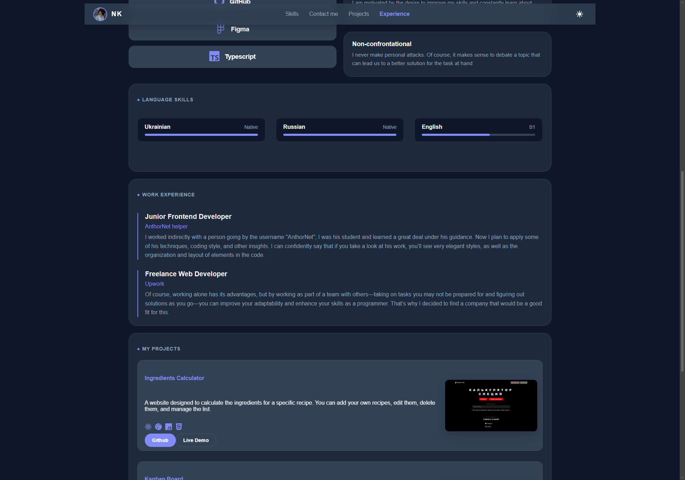

<div align="center">

# 🌐 Personal Portfolio

  <p>
    <a href="https://aliveagain3228.github.io/my-portfolio/" target="_blank">
      
    </a>
  </p>

  <p>
    
    
    
    
  </p>

</div>

## 🎨 About project

My personal portfolio, created to showcase my projects and skills. The design is inspired by **industrial minimalism**: clean lines, clean typography, and a focus on content.

### 📸 Main screen



## 🚀 Technology stack

- **Frontend:** React 19, TypeScript.
- **Styling:** Tailwind CSS (Custom UI Components).
- **Animations:** Framer Motion for smooth transitions.
- **Tools:** Vite, GitHub Pages for deploy.

## 📁 Main projects in the portfolio

- **Spice Calc:** Spice calculator with dynamic calculation.
- **Kanban Board:** A fully typed task management system.

## 🛠 Project launch

```bash
git clone [https://github.com/aliveagain3228/my-portfolio.git](https://github.com/aliveagain3228/my-portfolio.git)
cd my-portfolio
npm install
npm run dev
